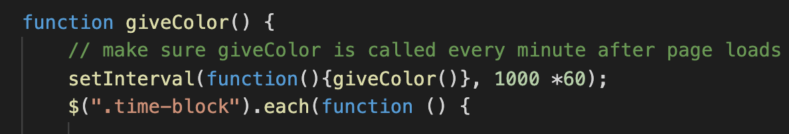

# Colin Whitcomb 

## Deployed Site
1) https://colin-whitcomb.github.io/work-day-scheduler/
___
## Summary & Processs

In this assignment our objective was to create a simple work day scheduler. The scheduler had to display the current date (screen shot 1), have time blocks that change color depending on the time of day, and store and save text written in each section (screen shot 2).

I began by working through the HTML elements and creating class and id names appropriate for their corresponding CSS. Afterwards I went on to tackle the script.js in the following order: creating the giveColor function which would change time block color, creating the save button to store text in local storage, and finally by creating a list of getItem lines to make sure the page was loaded with all current material found in local storage.

Although I made sure to complete all required tasks, I also added a setInterval function that calls the giveColor function every minute to ensure that colors are updated in the case that the hour changes as you are using the application (see the code snippet below).
___
## Screenshots 

1. **Current Date**

2. **Time blocks accept and store text**

3. **setInterval function to reload page**

___
## Technologies / Resources
- Javascript / jQuery
- HTML / CSS  
- Visual Studio Code
- Git / GitHub / GitPages
--- 
## Author

**Colin Whitcomb** [LinkedIn](https://ww.linkedin.com/in/colin-whitcomb-b808301a6/)

___
